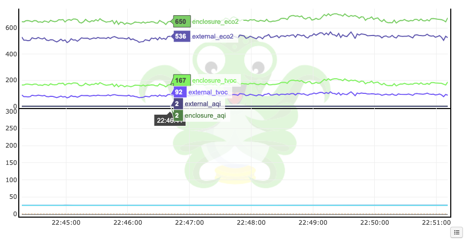

# OctoPrint-ENS160



Enables OctoPrint integration of air quality data from ENS160 Digital Metal-Oxide Multi-Gas (https://www.sciosense.com/ens16x-digital-metal-oxide-multi-gas-sensor-family/) sensors.

Data from this plugin will be automatically displayed with https://github.com/jneilliii/OctoPrint-PlotlyTempGraph.

## Recommended Hardware

- ENS160 sensors
    - Adafruit ENS160 MOX Gas Sensor (https://www.adafruit.com/product/5606)
    - SparkFun Indoor Air Quality Sensor - ENS160 (https://www.sparkfun.com/sparkfun-indoor-air-quality-sensor-ens160-qwiic.html)
- OPTIONAL: I2C multiplexer
  - If you want more than two sensors, a multiplexer board (like https://www.adafruit.com/product/4704) to avoid address conflicts.
- OPTIONAL: I2C extender
  - If you want to use longer lengths of cables (sensors will fail to work at longer cable lenghts without these).
  - Sparkfun Qwiicbus System (https://www.sparkfun.com/sparkfun-qwiicbus-kit.html)
  - Adafruit LTC4311 I2C Extender / Active Terminator (https://www.adafruit.com/product/4756).

## Installation

### Normal Installation

In [Plugin Manager](https://docs.octoprint.org/en/master/bundledplugins/pluginmanager.html), select '... from URL' and enter:

```
https://github.com/aerickson/OctoPrint-ENS160/archive/master.zip
```

### Advanced Installation

```bash
# NOTE: paths may vary

# activate the OctoPrint venv
. ./OctoPrint/bin/activate

# cd into this repo
cd ~/git/OctoPrint-ENS160

# isntall the plugin
pip3 install .`
```

## Configuration

### ENS160 Plugin

In OctoPrint, configure the plugin with the i2c ID's of your sensors.

Format: "name:hex_address,name2:hex_address2"
e.g., "External:40,Enclosure:41"

### Plotly Temp Graph

Data is automatically displayed in the Plotly Temp Graph plugin, but the layout can be optimized.

Editing the OctoPrint config.yaml is the easiest as all options are not exposed in the UI.

Relevant options are:
- 'use_sub_plot' (visible in the UI) which makes this series appear in a second upper graph.
- 'hover_template' that hides the degrees C/F label.

```yaml
 plotlytempgraph:
    _config_version: 5
    max_graph_height: '300'
    name_map:
    ...
    - color: '#4df444'
      hover_template: <b>%{y:.0f}</b>
      identifier: ens160_Enclosure_tvoc actual
      label: enclosure_tvoc
      use_sub_plot: true
    ...
```

## Troubleshooting

### LGPIO File not found

This may happen specifically on RPI 5 devices.

If you get lgpio errors (see below) when OctoPrint starts, you may need to add an environment variable to the SystemD service file.

https://github.com/joan2937/lg/issues/22
https://github.com/joan2937/lg/issues/12

```bash
# find out the path of the systemd service file
systemctl status rpi5-octopi  # or your service name

# edit the file and add the following:
#   Environment="LG_WD=/tmp"

# reload config
systemctl daemon-reload

# restart service
systemctl restart rpi5-octopi  # or your service name
```

#### example failure to load

```
2025-09-27 15:26:39,417 - octoprint.plugin.core - ERROR - Error loading plugin ENS160
Traceback (most recent call last):
  File "/home/aje/OctoPrint/lib/python3.11/site-packages/octoprint/plugin/core.py", line 1339, in _import_plugin
    module = _load_module(spec)
             ^^^^^^^^^^^^^^^^^^
  File "/home/aje/OctoPrint/lib/python3.11/site-packages/octoprint/plugin/core.py", line 74, in _load_module
    spec.loader.exec_module(sys.modules[spec.name])
  File "<frozen importlib._bootstrap_external>", line 940, in exec_module
  File "<frozen importlib._bootstrap>", line 241, in _call_with_frames_removed
  File "/home/aje/OctoPrint/lib/python3.11/site-packages/octoprint_ENS160/__init__.py", line 5, in <module>
    import board
  File "/home/aje/OctoPrint/lib/python3.11/site-packages/board.py", line 45, in <module>
    from adafruit_blinka.board.raspberrypi.raspi_5 import *
  File "/home/aje/OctoPrint/lib/python3.11/site-packages/adafruit_blinka/board/raspberrypi/raspi_5.py", line 6, in <module>
    from adafruit_blinka.microcontroller.bcm2712 import pin
  File "/home/aje/OctoPrint/lib/python3.11/site-packages/adafruit_blinka/microcontroller/bcm2712/pin.py", line 7, in <module>
    from adafruit_blinka.microcontroller.generic_linux.lgpio_pin import Pin
  File "/home/aje/OctoPrint/lib/python3.11/site-packages/adafruit_blinka/microcontroller/generic_linux/lgpio_pin.py", line 7, in <module>
    import lgpio
  File "/home/aje/OctoPrint/lib/python3.11/site-packages/lgpio.py", line 562, in <module>
    _notify_thread = _callback_thread()
                     ^^^^^^^^^^^^^^^^^^
  File "/home/aje/OctoPrint/lib/python3.11/site-packages/lgpio.py", line 504, in __init__
    self._file = open('.lgd-nfy{}'.format(self._notify), 'rb')
                 ^^^^^^^^^^^^^^^^^^^^^^^^^^^^^^^^^^^^^^^^^^^^^
FileNotFoundError: [Errno 2] No such file or directory: '.lgd-nfy-3'
```

## Links

- ENS160 datasheet
  - https://www.sciosense.com/wp-content/uploads/2023/12/ENS160-Datasheet.pdf

## TODO

- Get listed on https://plugins.octoprint.org/.
  - https://plugins.octoprint.org/help/registering/
- Query HTU31 sensors for humidity and temperature compensation (don't use static values).